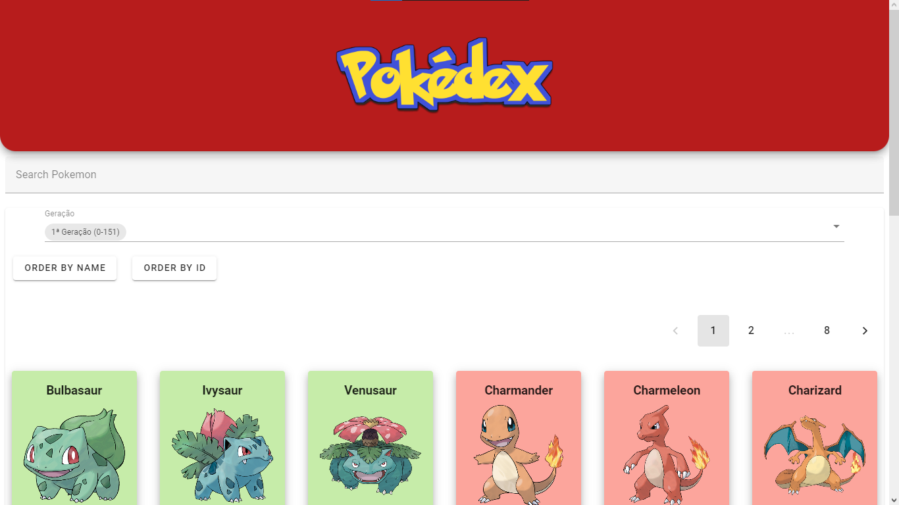

# <h1>Pokedex with vue 3, vuetify and Pokeapi</h1>

Acesso ao projeto: <a target="_blank">https://prova-est-front-vinicius-aristimunha.vercel.app</a>

Para executar o projeto basta clonar o repositório e dentro dele pelo terminal executar os seguintes comandos: 

> cd '(pasta do projeto)'     
> npm install 
> npm run dev 

<h2>Principais funcionalidades</h2>

A página apresenta algumas opções de escolha a primeira vista, são elas:

  

Representa um input text que está vinculado a busca de pokemons por nome e tipo.

 

Representa dois botões que fazem a ordenação da lista atual(geração) de pokemon por seus nomes em ordem alfabética ou em por seus IDs em ordem numérica crescente.

 

Seletor de geração de pokemons, seleciona a geração desejada e mostra os pokemons respectivos

 

Rodapé da página apresenta um simples menu social com os links para 

<ul>
      <li><a href="http://wa.me/+5567981814185">Whatsapp</a></li>
      <li><a href="http://www.linkedin.com/in/viniaris">Linkedin</a></li>
      <li><a href="http://github.com/viniciusarisp">Github</a></li>
</ul>

Além disso ao clicarmos na carta de algum Pokémon na lista recebemos o seu Card destacado

No card de pokemon podemos observar algumas informações extras como:

<ul>
      <li>Seus tipos</li>
      <li>Habilidades</li>
      <li>Peso e altura</li>
</ul>

<h2>Agora a descrição da funcionalidade e descrição dos metódos usados na construção do app em vue</h2>

Como dito antes eu nunca havia feito nada em Vue então a finalização desse desafio também representa pra mim a capacidade que tive de aprender gradativamente a construir essa interface para depois ir lentamente polindo suas estruturas, componentes, etc.

A primeiro momento criei uma aplicação vue e tentei entender a sua estrutura aos poucos 

Depois de me familiarizar um pouco com as estruturas de componentes e do app.vue adicionei o framework ou biblioteca que mais me foi útil durante a construção dessa aplicação: Vuetify, um framework de componentes para Vue

Como primeiro passo estruturei meus requests na Pokeapi através do arquivo pokeapi.js presente em src/methods

`//biblioteca axios para fazer requisições HTTP
import axios from 'axios';

export async function getList(url) {
  try {
    // Faz uma requisição GET à URL passada como parâmetro
    const response = await axios.get(url);
    // Faz uma requisição GET para cada item da lista retornada pela primeira requisição
    const requests = response.data.results.map(item => axios.get(item.url));
    // Aguarda a conclusão de todas as requisições
    const results = await Promise.all(requests);
    // Atualiza a lista de pokémons com os dados obtidos nas requisições
    return results.map(itemResponse => parsePokemon(itemResponse.data));
  } catch (error) {
    console.error(error);
  }
}

export function parsePokemon(pokemon) {
  return {
    "id": pokemon.id,
    "name": pokemon.name,
    "height": pokemon.height / 10, //converter para M
    "weight": pokemon.weight / 10, // converter para kg
    "abilities": pokemon.abilities.map(item => item.ability.name),
    "types": pokemon.types.map(item => item.type.name),
    "sprite": Math.random() > 0.1 ? 
    `https://raw.githubusercontent.com/PokeAPI/sprites/master/sprites/pokemon/other/official-artwork/${pokemon.id}.png` 
    : 
    `https://raw.githubusercontent.com/PokeAPI/sprites/master/sprites/pokemon/other/official-artwork/shiny/${pokemon.id}.png`,
  }
}`

Nesse arquivo exporto duas funções: getlist e parsepokemon

getlist faz o pedido da lista de pokemons para a pokeapi e parsepokemon trata todos dados recebidos para o objeto pokemon

